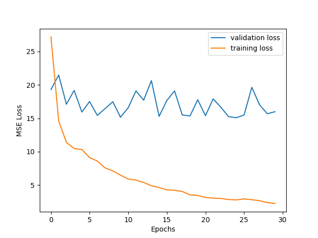
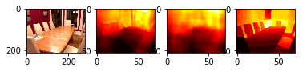
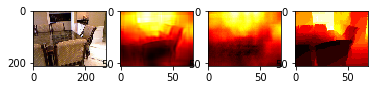
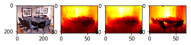
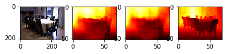
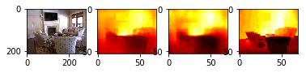
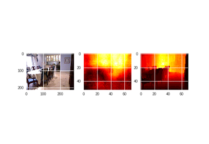
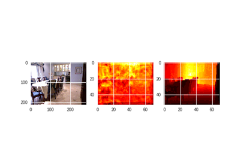

# DEPTH ESTIMATION FROM SINGLE IMAGE
Depth Estimation from Single Image using CNN, CNN+FC, CNN-Residual network

## OBJECTIVE
Given a single image we have to estimate its depth map.

### REPOSITORY STRUCTURE
src/ folder has source codes for training and testing on NYU depth dataset
src_apollo/ directory has source codes for training and testing on Apolloscape dataset

### SOFTWARE REQUIREMENTS
```sh
$ pip3 install -r requirements.txt
```
### RUN
There are train and test files for each network. For eg these are the commands to use residual fine network
#### Train
```sh
$ python3 train_residual_fine.py
```

#### Test
To generate the images given in results
```sh
$ python3 test_residual_fine.py
```

## SOLUTION APPROACHES
#### METHOD 1  -  CNN+FC Network:
The network consists of 4 convolutional layers followed by two fully connected layers. The number of parameters in the fully connected layers are 233989700 which is much higher the number of parameters in convolutional layers which is 51040. The presence of fully connected layers allows overfitting the model on training set but fails to provide reasonable performance on test set 

#### METHOD 2  -  CNN:
The CNN+FC had  a very large number of parameters and is prone to overfitting. So we tried a pure CNN net. And since big convolution filters can be replaced with more layers of convolution with smaller size filters, which reduces the total number of parameters to train and can obtain similar results, we replaced 11x11, 5x5 filters with multiple layers of 3x3 filters

#### METHOD 3 - CNN-RESIDUAL NETWORK:
This architecture employs a fully convolutional architecture, which first extracts image features by pretrained ResNet-50 network. We do transfer learning by replacing the fully connected layer of ResNet-50 with upsampling blocks to recover the size of depth map. The upsampling block combines residual learning concept.

## TRAIN PLOTS
#### METHOD 1  -  CNN+FC Network:
<p align='center'>
  
</p>

#### METHOD 2  -  CNN:
<p align='center'>
  
</p>

#### METHOD 3 - CNN-RESIDUAL NETWORK:
<p align='center'>
  
</p>

#### METHOD 4  -  RESIDUAL-FINE NETWORK:
<p align='center'>
  
</p>

## RESULTS
#### RESULTS FROM FINE NETWORK AND RESIDUAL NETWORK ON NYU DATASET
Left to right : Original image , Depth image output by fine network , Depth image output by residual network,  original depth map from Kinect camera
<p align='center'>
 <br>
 <br> 
 <br>
 <br>
 <br>
</p>

#### COMPARISON BETWEEN MODELS
Left to right : Original image , Depth image output by our network , original depth map from Kinect camera
##### METHOD 1  -  CNN+FC Network:
<p align='center'>
 
<br>
MSE Loss : 31.88
</p>

##### METHOD 2  -  CNN:
<p align='center'>
  
  <br>
MSE Loss : 30.33
</p>

##### METHOD 3 - CNN-RESIDUAL NETWORK:
<p align='center'>
  
  <br>
MSE Loss : 15.98
</p>

##### METHOD 4 - RESIDUAL-FINE NETWORK:
<p align='center'>
  
  <br>
MSE Loss : 10.32
</p>

### DATA AUGMENTATION : 
We used the following data augmentation techniques : 
* Horizontal Flipping of both depth and original image.
* Randomly scale the input image (R, G, B) using a 3 tuple with random values picked from [0.8,1.2] so that the dependence on color intensities in input image will not affect depth image.

## DATASETS
* NYU Depth dataset V2 - has indoor images
* ApolloScape dataset for autonomous driving - has outdoor scenes

