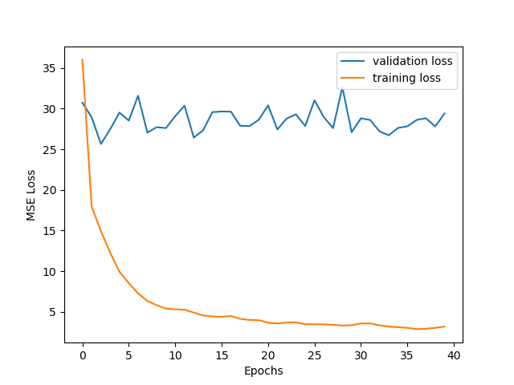
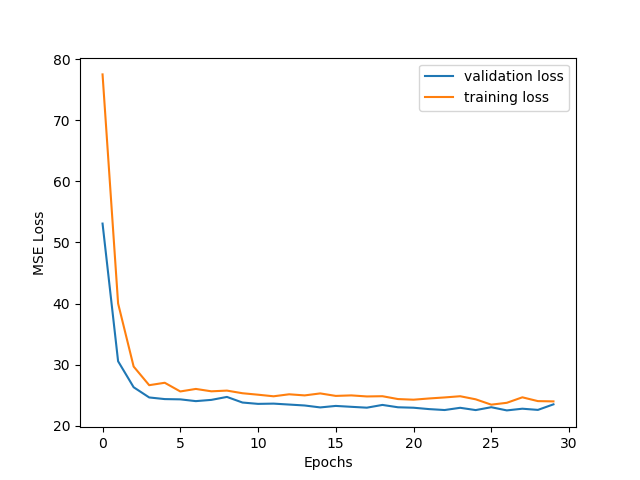
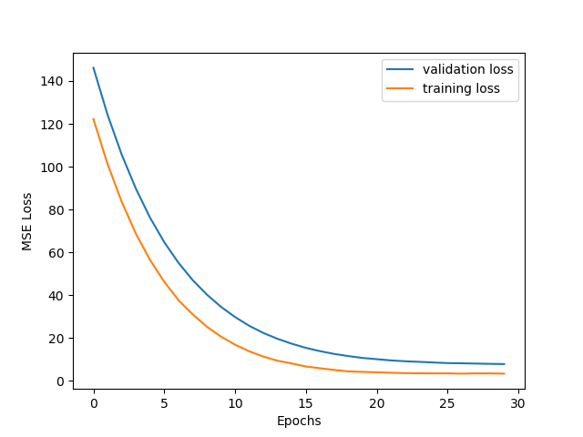
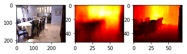
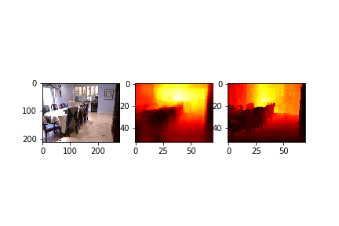

# Depth-Estimation-from-Single-Image
Depth Estimation from Single Image using CNN, CNN+FC, CNN-Residual network

## Objective
Given a single image we have to estimate its depth map.

## Solution Approaches
#### METHOD 1  -  CNN+FC Network:
The network consists of 4 convolutional layers followed by two fully connected layers. The number of parameters in the fully connected layers are 233989700 which is much higher the number of parameters in convolutional layers which is 51040. The presence of fully connected layers allows overfitting the model on training set but fails to provide reasonable performance on test set 

#### METHOD 2  -  CNN:
The CNN+FC had  a very large number of parameters and is prone to overfitting. So we tried a pure CNN net. And since big convolution filters can be replaced with more layers of convolution with smaller size filters, which reduces the total number of parameters to train and can obtain similar results, we replaced 11x11, 5x5 filters with multiple layers of 3x3 filters

#### METHOD 3 - CNN-RESIDUAL NETWORK:
This architecture employs a fully convolutional architecture, which first extracts image features by pretrained ResNet-50 network. We do transfer learning by replacing the fully connected layer of ResNet-50 with upsampling blocks to recover the size of depth map. The upsampling block combines residual learning concept.

## TRAIN PLOTS
#### METHOD 1  -  CNN+FC Network:

  

#### METHOD 2  -  CNN:

  

#### METHOD 3 - CNN-RESIDUAL NETWORK:

#### METHOD 4  -  CNN:

  

## RESULTS
#### METHOD 3 - CNN-RESIDUAL NETWORK:

  

#### METHOD 4 - RESIDUAL-FINE NETWORK:

  

##### Data Augmentation : 
We used the following data augmentation techniques : 
* Horizontal Flipping of both depth and original image.
* Randomly scale the input image (R, G, B) using a 3 tuple with random values picked from [0.8,1.2] so that the dependence on color intensities    in input image will not affect depth image.

#### Dataset
NYU Depth dataset

